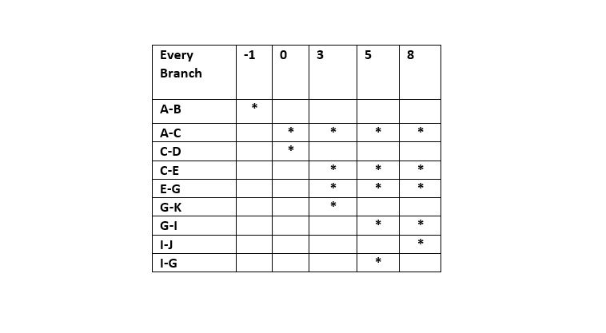

# Second Lab on the course Software engineering
## Agron Selimi(165042) 
At first I had a lot of problems with IntelliJ I couldn't fix the Cyrilic encoding, shortly i will  fix 
and then I'll  update the entire README in Macedonian. 

### The Given Function:

### 1 Control Flow Graph of the Function 

 
### Cyclomatic Cmplexity  
Cyclomatic complexity of this code is 5. I got the results form the formula P +1, 
where P is the number of breanches in this case P = 4. Aording to the formula cyclomatic complexity is 5.

### Test Cases Acording to Every Branch 

### Explaingin Unit Test Cases
I made a test class in src / test / java called SILab2Test on which I wrote special functions with 
the notation @Test for each of the criteria

-Unit Testing for every branch criteria 
I have written total  5 unit test cases, the first one throws an exception and so we 
use assertThrows () and then using assertTrue () we just check if that exception is the one we expect to throw in those 
cases, the other tests are simpler as we only expect a boolean result true or false and this is made possible by the
 assertTrue () and assertFalse () methods
 
 
